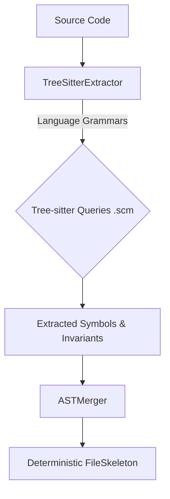

# Design Proposal: Universal Multi-Language Indexing (Tree-sitter + Private Symbols)

## 1. Problem Statement
The current AST extraction approach relies heavily on regex heuristics for languages other than Python (e.g., TypeScript, JavaScript, Go). This approach is inherently fragile, difficult to scale to new languages, and prone to edge-case failures. Additionally, there is a need to extract private symbols (prefixed with `_` or non-exported) to provide richer context for LLMs, but this must be balanced against the risk of token bloat and context degradation.

## 2. Proposed Design
We propose transitioning from regex-based heuristics to a unified `TreeSitterExtractor` utilizing `tree-sitter-languages` for TS/JS/Go/Java/Kotlin. 

**High-Level Architecture:**

**Key Components:**
- **Unified `TreeSitterExtractor`:** A single class capable of parsing multiple languages by delegating to specific `tree-sitter` grammars.
- **Mapping Strategy:** We will utilize Tree-sitter Queries (`.scm` files) to create a language-agnostic extraction layer. This decouples the extraction logic from the underlying language's AST structure.
- **Symbol Policy (Private Symbols):** Private symbols (e.g., non-exported in Go, or prefixed with `_` in Python/TS) will be included in the extraction.
- **Noise Filtering ("Summarization Cap"):** To address Blueprint Bloat, we will enforce a strict summarization cap for private symbols, limiting them to short, one-sentence summaries.
- **ID Stability:** We will implement stable SHA-256 Fully Qualified Domain Name (FQDN) IDs that account for language-specific scoping (e.g., namespaces in Java vs. exports in JS).

**Configuration Flags:**
The following flags will be added to control extraction behavior:
- `include_private_symbols` (bool): Toggles the extraction of non-exported/private symbols.
- `language_grammars` (list): Defines the list of active tree-sitter grammars to load.

## 3. Alternatives Considered
- **Maintaining Regex Heuristics:** Rejected due to high maintenance burden and inability to accurately parse complex language features (e.g., nested scopes, generics).
- **Language-Specific Parsers:** While Python uses `ast`, adopting `babel` for JS, or Go's `ast` package would require maintaining separate CLI wrappers and environments, increasing deployment complexity.
- **Skipping Private Symbols:** Rejected because private symbols contain critical context and invariants necessary for accurate LLM enrichment and reasoning.

## 4. Implementation Steps
1. **Dependency Management:** Integrate pre-compiled `tree-sitter-languages` wheels to resolve the "Dependency Hell" concern and avoid requiring local compilation toolchains.
2. **Update `ast_extractor.py`:** Implement the `TreeSitterExtractor` class to replace `_extract_ts_js_heuristic` and `extract_from_go`.
3. **Query Definitions:** Author `.scm` files for each target language (TS, JS, Go, Java, Kotlin) to capture functions, classes, interfaces, and invariants.
4. **ASTMerger Integration:** Update `ASTMerger` to handle the new FQDN IDs and ensure stable merging with LLM-generated enrichments.
5. **Summarization Logic:** Implement the summarization cap logic for private symbols during the symbol object instantiation.

## 5. Sphinch Marks (Readiness Assertions)

<!-- Cross-Document Consistency -->
- [ ] `include_private_symbols` and `language_grammars` flag names are consistent across this document and configuration schema.
- [ ] Tool names (`TreeSitterExtractor`, `ASTMerger`) match existing codebase naming conventions.

<!-- Interface Accuracy -->
- [ ] `TreeSitterExtractor` output strictly conforms to `Tuple[List[ExportedSymbol], List[ImplementationInvariant]]`.
- [ ] `ASTMerger.merge` correctly consumes the FQDN-based IDs generated by the new extractor.

<!-- State Machine Completeness -->
- [ ] Fallback mechanisms are defined if a `.scm` query fails for a specific language grammar.
- [ ] Summarization cap correctly truncates multi-sentence docstrings to a single sentence without losing critical keywords.

<!-- Failure Mode Coverage -->
- [ ] Pre-compiled wheel load failures cleanly fall back to a minimal subset or log an actionable warning.
- [ ] Malformed source code parsing errors are caught and return empty lists (matching current `SyntaxError` handling).

<!-- Dependency Declarations -->
- [ ] `tree-sitter-languages` is added to `requirements.txt` with a pinned version.
- [ ] `.scm` query files are explicitly included in the package manifest/build config.
